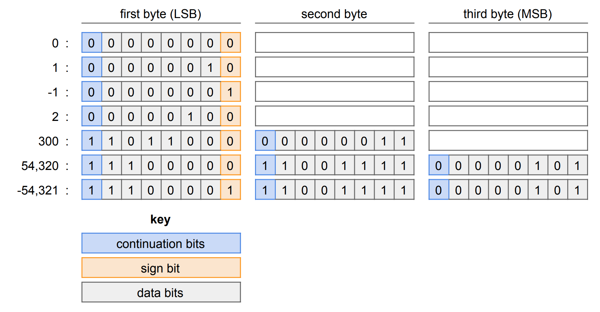

bigint-serialiser
=============

## About

This module provides a transcoder for serialising JavaScript BigInt values to a
`Uint8Array` or any other array-like object.

Bytes are stored in little-endian order, with the first bit of each byte
indicating whether the bytes that follow it are a continuation of the encoding.
Negative numbers are stored as one less than their magnitude, with the sign bit
set. The sign bit is at the end of the first byte.



## Installation

```sh
npm install bigint-serialiser
```

## Usage

### `encode(value: bigint): Uint8Array`

`encode` takes a bigint and returns a Uint8Array containing the encoded bytes.

```js
let { encode } = require('bigint-serialiser');
let bytes = encode(300n);
```

### `encodeInto(value: bigint, byteArray: Uint8Array, offset: ?number = 0): number`

`encodeInto` takes a bigint, an array-like, and an optional offset. If the
offset is not given, `0` is used for the offset. `encodeInto` writes the bytes
of the encoding of `value` into `byteArray`, starting at `offset`. `encodeInto`
returns the offset following the last byte written. If `encodeInto` would write
past the end of `byteArray`, `encodeInto` will throw after partially writing
the encoding of `value` to `byteArray`.

```js
let { encodeInto } = require('bigint-serialiser');
let bytes = new Uint8Array(5); // [ 0, 0, 0, 0, 0 ]
let followingOffset = encodeInto(300n, bytes, 2); // 4
bytes; // [ 0, 0, 216, 3, 0 ]
```

### `decode(byteArray: Uint8Array, offset: ?number): bigint`

`decode` reads a bigint value from an array-like `byteArray`, starting from an
optional `offset`. If `offset` is not given, `0` is used for the offset.

```js
let { decode } = require('bigint-serialiser');
let bytes = Uint8Array.of(216, 3, 0);
decode(bytes); // 300n
decode(bytes, 1); // -2n
decode(bytes, 2); // 0n
```

### `decodeWithOffset(byteArray: Uint8Array, startingOffset: ?number): { value: bigint, followingOffset: number }`

`decodeWithOffset` reads a bigint value from an array-like `byteArray`,
starting from an optional `startingOffset`. If `startingOffset` is not given,
`0` is used for the offset. `decodeWithOffset` returns an object with the
bigint in its `value` field and the offset following the last byte read in its
`followingOffset` field.

```js
let { decodeWithOffset } = require('bigint-serialiser');
let bytes = Uint8Array.of(216, 3, 0);
decodeWithOffset(bytes); // { value: 300n, followingOffset: 2 }
```

## Contributing

* Open a Github issue with a description of your desired change. If one exists already, leave a message stating that you are working on it.
* Fork this repo, and clone the forked repo.
* Install dependencies with `npm install`.
* Make sure the tests pass in your environment with `npm test`.
* Create a feature branch. Make your changes. Add tests.
* Test your changes with `npm test`.
* Make a commit that includes the text "fixes #*XX*" where *XX* is the Github issue number.
* Open a Pull Request on Github.

## License

    Copyright 2019 Michael Ficarra

    Licensed under the Apache License, Version 2.0 (the "License");
    you may not use this file except in compliance with the License.
    You may obtain a copy of the License at

        http://www.apache.org/licenses/LICENSE-2.0

    Unless required by applicable law or agreed to in writing, software
    distributed under the License is distributed on an "AS IS" BASIS,
    WITHOUT WARRANTIES OR CONDITIONS OF ANY KIND, either express or implied.
    See the License for the specific language governing permissions and
    limitations under the License.
